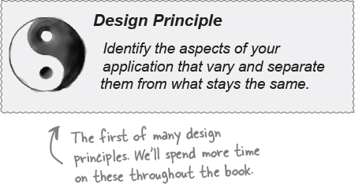
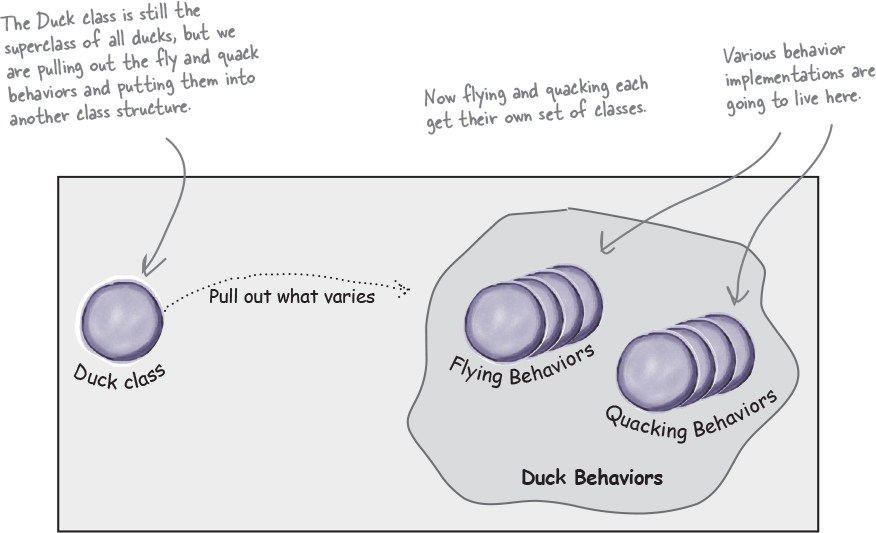
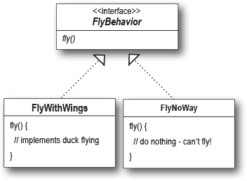

## Design Principle #1
So we know using inheritance hasn’t worked out very well, 
since the duck behavior keeps changing across the subclasses, 
and it’s not appropriate for all subclasses to have those behaviors. 
The Flyable and Quackable interface sounded promising at first—only 
ducks that really do fly will be Flyable, etc.—except Java interfaces 
typically have no implementation code, so no code reuse. In either case,
whenever you need to modify a behavior, you’re often forced to track down 
and change it in all the different subclasses where that behavior is defined, 
probably introducing new bugs along the way!

Luckily, there’s a design principle for just this situation.

In other words, if you’ve got some aspect of your code that is changing, 
say with every new requirement, then you know you’ve got a behavior that 
needs to be pulled out and separated from all the stuff that doesn’t change.

Here’s another way to think about this principle: 
take the parts that vary and encapsulate them, 
so that later you can alter or extend the parts that vary without 
affecting those that don’t.

Separating what changes from what stays the same
Where do we start? As far as we can tell, other than the problems with fly() and quack(), the Duck class is working well and there are no other parts of it that appear to vary or change frequently. So, other than a few slight changes, we’re going to pretty much leave the Duck class alone.

Now, to separate the “parts that change from those that stay the same,” we are going to create two sets of classes (totally apart from Duck), one for fly and one for quack. Each set of classes will hold all the implementations of the respective behavior. For instance, we might have one class that implements quacking, another that implements squeaking, and another that implements silence.

- We know that fly() and quack() are the parts of the Duck class that vary across ducks.
- To separate these behaviors from the Duck class, we’ll pull both methods out of the Duck class and create a new set of classes to represent each behavior.

## Designing the Duck Behaviors

So how are we going to design the set of classes that implement the fly and quack behaviors?

We’d like to keep things flexible; after all, it was the inflexibility in the duck behaviors that got us into trouble in the first place. And we know that we want to assign behaviors to the instances of Duck. For example, we might want to instantiate a new MallardDuck instance and initialize it with a specific type of flying behavior. And while we’re there, why not make sure that we can change the behavior of a duck dynamically? In other words, we should include behavior setter methods in the Duck classes so that we can change the MallardDuck’s flying behavior at runtime.

Given these goals, let’s look at our second design principle:

Images
We’ll use an interface to represent each behavior—for instance, FlyBehavior and QuackBehavior—and each implementation of a behavior will implement one of those interfaces.

So this time it won’t be the Duck classes that will implement the flying and quacking interfaces. Instead, we’ll make a set of classes whose entire reason for living is to represent a behavior (for example, “squeaking”), and it’s the behavior class, rather than the Duck class, that will implement the behavior interface.

This is in contrast to the way we were doing things before, where a behavior came either from a concrete implementation in the superclass Duck, or by providing a specialized implementation in the subclass itself. In both cases we were relying on an implementation. We were locked into using that specific implementation and there was no room for changing the behavior (other than writing more code).

With our new design, the Duck subclasses will use a behavior represented by an interface (FlyBehavior and QuackBehavior), so that the actual implementation of the behavior (in other words, the specific concrete behavior coded in the class that implements the FlyBehavior or QuackBehavior) won’t be locked into the Duck subclass.

We do this in thirdduckdesign package