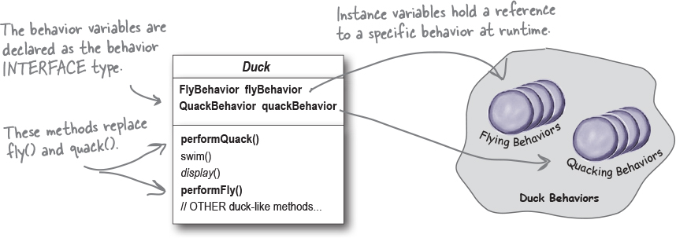
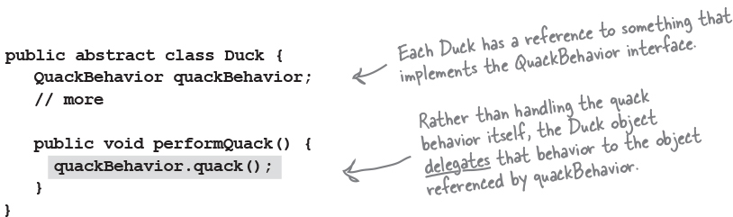
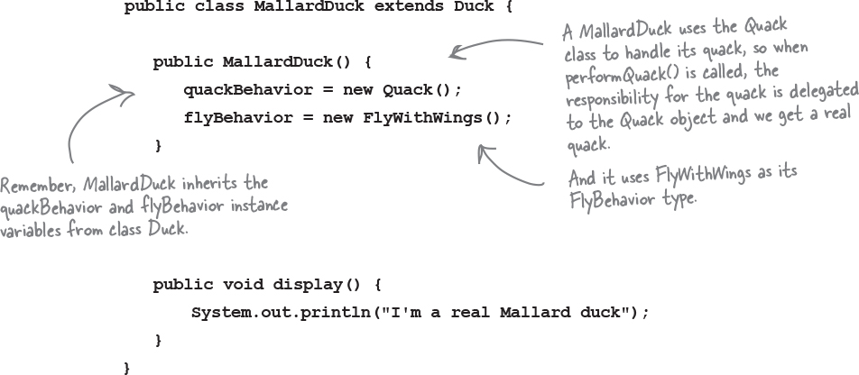

With this design, other types of objects can reuse fly and quack behaviors because it's no longer tied to duck
classes. We can now add new behaviors without modifying any existing behavior classes or touching any of the duck classes
that use flying or quacking behaviors

Images
Pretty simple, huh? To perform the quack, a Duck just asks the object that is referenced by quackBehavior to quack for it. In this part of the code we don’t care what kind of object the concrete Duck is, all we care about is that it knows how to quack()!

